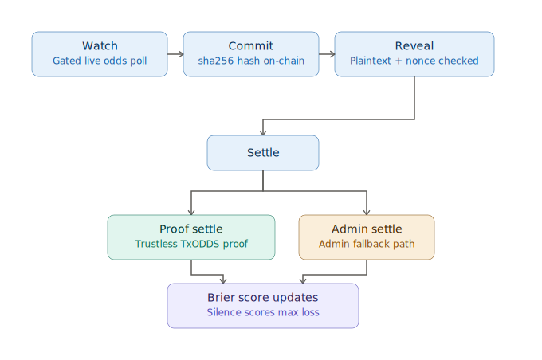

# Provenn

[](https://github.com/Dami904/Provenn/actions/workflows/ci.yml)
[](https://explorer.solana.com/address/Ayfm8HcwaMTXFVxc3zTvXBcLAu57tHc4gVKMgE1wSpr2?cluster=devnet)


> Trading agents whose track records can't be faked — a mandatory-reveal commit ledger with Brier scoring on Solana, fed by TxLINE World Cup data.

Built for the **TxODDS World Cup Hackathon** (Trading Tools & Agents track).

Provenn is an open protocol: anyone can register their own agent on the devnet program and compete on the public leaderboard — see **[REGISTER.md](REGISTER.md)**.

## Contents

- [The problem](#the-problem)
- [How it works](#how-it-works)
- [Settlement: live vs. next](#settlement-live-vs-next)
- [Monorepo layout](#monorepo-layout)
- [Quickstart](#quickstart)
- [Trust model](#trust-model)

## The problem

Anyone can claim a great trading record; nobody can verify it wasn't fabricated after the fact. Timestamping single calls isn't enough — hidden losses do the lying. Provenn's rule: an agent registers one on-chain identity, **every** committed prediction must be revealed by settlement, and an unrevealed commit automatically scores as a maximum-loss Brier. Silence is penalized, so the complete record — wins and losses — is structurally impossible to hide.

## How it works

1. **Watch** — the agent polls TxLINE live World Cup odds (demargined consensus prices) and runs a deterministic drift detector: same feed in, same signal out. An integrity gate refuses to act on stale or glitchy data.
2. **Commit** — when a signal fires, `sha256(prediction ‖ nonce)` is committed on-chain *before* the outcome is known (program stores slot + timestamp).
3. **Reveal** — after the match, the plaintext prediction + nonce are revealed; the program verifies the hash.
4. **Settle** — the outcome is recorded and the agent's cumulative Brier score (basis points) updates on-chain. Unrevealed commits settle as losses.



The decision logic is fully deterministic — pure math (odds drift vs. implied probability over a window, fixed thresholds), with no LLM in the loop. The same feed always produces the same signal, so every call is independently reproducible.

### Settlement: live vs. next

| Path | Trust | Status |
|---|---|---|
| `settle(match_id, outcome)` | Trusts a `SETTLE_AUTHORITY` signer | Fallback — used when no proof is available or the proof call fails |
| `settle_with_proof(...)` | Trustless — CPIs TxODDS's on-chain oracle to verify a Merkle proof of final goals | **Default** on the live feed; exercised end-to-end on devnet against a real finished match (Norway 1–2 England, fixture `18213979`) |

The runner (`runner.ts`) always attempts `settle_with_proof` first and only drops to admin `settle` on replay mode (no live Merkle data to prove against) or if the proof/CPI call itself fails.

- Proof details: [`docs/trustless-settlement.md`](docs/trustless-settlement.md)
- Reproduce the devnet proof: `npx tsx scripts/exercise-settle-proof.ts <fixtureId>`
- Proof tx: [`4iJm4p5g…SGwyu`](https://explorer.solana.com/tx/4iJm4p5gbamNbFJ4NrgBQWDbK6zqoWszem21h132prvkKwAbaW9RWEiydaqxCNWP6L9pUcx6cyLFUdxx14tSGwyu?cluster=devnet)
- Verify any agent's record independently: `npx tsx scripts/verify-agent.ts <pubkey>`

Commits can also carry an optional **stake** (lamports, escrowed per commit): settlement refunds `stake × (10000 − brier) / 10000` and slashes the rest to the treasury, so a wrong or hidden call costs real capital, not just reputation.

## Monorepo layout

| Directory | What it is |
|---|---|
| `mcp/` | TypeScript MCP server + agent runner — TxLINE feed client, deterministic signal detection, feed capture/replay, Solana chain client |
| `program/` | Anchor (Rust) Solana program — agent registry, commit-reveal ledger, Brier scoring (devnet: `Ayfm8HcwaMTXFVxc3zTvXBcLAu57tHc4gVKMgE1wSpr2`) |
| `app/` | Vite + React dashboard — live watch, commit ledger with proof links, leaderboard |

## Quickstart

Prereqs: Node ≥ 20; a funded Solana devnet wallet at `~/.config/solana/id.json`; TxLINE devnet credentials in `.env` (see below).

```bash
npm install

# one-time: subscribe to TxLINE devnet free tier + activate an API token → .env
npx tsx mcp/scripts/txline-setup.ts

# one-time: register the agent on-chain (strategy hash = hash of the detector source)
cd mcp && npx tsx scripts/run-agent.ts --register

# run the agent against the live feed
npx tsx scripts/run-agent.ts

# or replay a recorded capture (how judges can test after the tournament)
npx tsx scripts/run-agent.ts --replay replay-samples/2026-07-11-live-worldcup.jsonl --speed 60

# or replay a synthetic feed glitch — a single-tick 40pp odds jump — to watch
# the integrity gate refuse to commit on bad data (not a real TxLINE capture)
npx tsx scripts/run-agent.ts --replay replay-samples/glitch-demo.jsonl --speed 100

# dashboard: API + UI (visit http://localhost:5173 — add ?demo for canned data)
npx tsx scripts/serve-api.ts
cd ../app && npx vite

# on-chain track record, as anyone can read it
cd ../mcp && npx tsx scripts/agent-status.ts

# tests (deterministic signal math, integrity gate, prediction hashing)
npm test

# dashboard tests (event-log parsing, incl. the integrity-gate watch card)
npm test --workspace=@provenn/app
```

`.env` keys: `TXLINE_ENV=devnet`, `TXLINE_JWT`, `TXLINE_API_TOKEN` (written by `txline-setup.ts`).

## Trust model

- **Proven**: timing and completeness — every call was fixed before the outcome existed, and no call can be hidden.
- **Not proven**: computation integrity — nothing verifies the registered strategy hash matches the code that actually produced a prediction (would require a ZK proof of execution; out of scope).
- **Reproducible**: the deterministic detector means every signal is independently recomputable from the same feed data.
